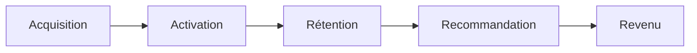

---
aliases:
  - Framework AARRR
  - Pirate Metrics Framework
title: Framework AARRR
datePublished: 2022-07-31T03:15
dateUpdated: 2022-07-31T03:15
permalink: aarrr
publish: true
rss: true
rating: 3
---

AARRR est un framework développé par Dave McClure, qui modélise le cycle de vie de l'utilisation d'un produit ou d'un service par un utilisateur.

Il comprend 5 étapes qui forment un entonnoir :

1. Acquisition
2. Activation
3. Rétention
4. Recommandation
5. Revenu

## 1. Acquisition

Il s'agit ici de récupérer le nombre de nouveaux visiteurs uniques qui arrivent sur votre site via un ensemble de canaux différents.

Un canal d'acquisition s'évalue selon 3 critères :

1. Volume
2. Coût d'acquisition / Temps d'acquisition
3. Taux de conversion

PS : Vous pouvez ajouter des [[Paramètres UTM]] à vos liens ou utiliser un raccourcisseur de lien comme [bit.ly](https://bit.ly) pour connaitre le canal utilisé.

## 2. Activation

Parvenir à faire en sorte que les gens utilise le produit ou service.

À cette étape, on récupère généralement le nombre d'utilisateurs inscrits.

PS : Faire beaucoup d'A/B testing pour trouver les composants qui ont un meilleur taux de conversion.

## 3. Rétention

Si votre taux de rétention n'est pas bon, vos efforts d'acquisition ou d'activation ne servent à rien. C'est comme si vous mettiez de l'eau dans un seau percé.

Définissez le critère de rétention et retenez le pourcentage de personnes à effectuer l'action.

Exemple : quand un utilisateur réutilise ou rachète un produit.

C'est l'opposé du CHURN (taux d'abandon).

<!-- [DAU/MAU ratio](https://geckoboard.com/best-practice/kpi-examples/dau-mau-ratio/) -->
<!-- Stripe churn -->

## 4. Recommandation

Le nombre d'utilisateurs à inviter d'autres personnes.

## 5. Revenu

Le nombre d'utilisateurs qui payent le produit ou service.

---

Références :

- [[Corey Haines - Mental Models For Marketing]]
- Le livre de la jungle - Younès Rharbaoui
- [[Traction - Gabriel Weinberg]]
- https://yannleonardi.com/framework-aarrr/
- https://airtable.com/shrzVGqmdLpoPQF9i
- [The Ouss Shadow Army - Le framework AARRR (OUSSAMA AMMAR)](https://youtu.be/xf7oPPjvpA4)