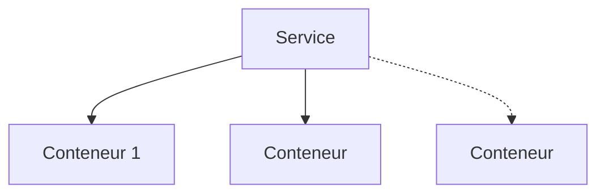

Il est possible de créer plusieurs conteneurs dans un seul service Docker. Ces conteneurs sont appelé des replicas.



La commande suivante aura pour objectif de créer 3 replicas basé sur l'image Docker ghost :

```bash
docker service create --replicas 3 ghost
```

Si on exécute la commande `docker ps -a`, on remarquera l'apparition de 3 conteneurs ghost.