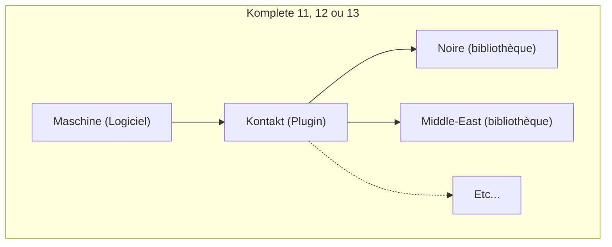

Si vous êtes compositeur de musiques, voici toutes les étapes à suivre pour installer un environnement de musique sur Windows avec Ableton et Maschine.

**DISCLAIMER : Tout ce qui est dans cet article est présenté uniquement à des fins éducatives. Les liens présents dans cet article ne proviennent pas de moi ou d'une source officielle. Veuillez suivre ce tutoriel UNIQUEMENT en connaissance de cause.**

## Installation de Ableton

1. [Télécharger Ableton v11.0.0](https://bit.ly/3wd4o2u)
2. Exécuter le fichier d'installation `Ableton Live 11 Suite Installer.exe`
3. Remplacer le fichier `C:\ProgramData\Ableton\Live 11 Suite\Program\Ableton Live 11 Suite.exe` par le fichier `Ableton Live 11 Suite.exe`
4. Désactiver temporairement Windows Defender dans Sécurité Windows -> Contrôle des applications et du navigateur -> Paramètres de protection fondée sur la réputation -> Vérifier les applications et les fichiers
5. Démarrer Ableton puis cliquez sur "Pas d'internet sur cet ordinateur"
6. Copier le code matériel qui s'affiche ou cliquez sur "Sauvegarder" pour enregistrer le code dans un fichier TXT
7. Executer le fichier keygen `Ableton_KeyGen.exe` et renseignez le code matériel dans le champ Hardware Code
8. Sauvegarder le fichier `Authorize.auz` et déplacez-le à l'intérieur de la fenêtre de Ableton Live (Drag and Drop)
9. (IMPORTANT) Désactivez les mises à jour dans "Options" -> "Préférences" -> Licenses -> Maintenance (sélectionnez "Jamais")

## Installation de Maschine 2.12

1. [Télécharger Maschine 2.12.0](https://bit.ly/3pCvaPw)
2. Montez le fichier `Maschine 2 2.12.0 Setup PC.iso` (clic droit + monter)
3. Executez le fichier `Maschine 2 Setup PC.exe`
4. Montez le fichier `R2R.iso` et exécutez le fichier `Maschine_Keygen.exe` (sans oublier de désactiver votre anti-virus temporairement)
5. Vous pouvez à présent lancer Maschine

## Relier Maschine dans Ableton

1. Ajouter le dossier `C:\Program Files\Native Instruments\VSTPlugins 64 bit` (ou 32 bit selon l'architecture de votre PC) dans Préférences -> Plug-ins -> Dossier VST2 et Dossier VST3

## Installation de Kontakt 6.5.3

1. [Téléchargement de Kontakt 6.5.3](https://bit.ly/3x5QYpc)
2. Executer `Kontakt Setup PC 6.5.3.exe`
3. Garder le fichier `Add Library.exe` à portée de main pour pouvoir ajouter des bibliothèques (Middle East, Noire, Ethno world, etc...)

## Installation des bibliothèques

Il existe le pack Komplete 12 de Native Instruments qui est une suite de bibliothèques et de plug-ins. Mais la version cracké de Native Access ne fonctionne pas.

Du coup il vaut mieux télécharger les librairies et plug-ins un par un.

Télécharger et extraire les bibliothèques dans un dossier "Librairies" :

- [Middle East](https://bit.ly/3xfFTC4)
- [Noire](https://bit.ly/3xfFTC4)
- [Action Strikes](https://bit.ly/2RK6Led)
- [Strummed Acoustic](https://bit.ly/3gjEkfi)
- [Ethno world 6](https://bit.ly/3zirabk)

Ajoutez-les dans Kontakt avec l'exécutable `Add Library.exe`

Ajouter le chemin vers votre dossier "Librairies" dans Maschine -> Préférences -> Library -> User

Redémarrer Maschine et vérifier si elles apparaissent bien dans les "Instruments".

Si ce n'est pas le cas, vérifier que Maschine détecte correctement Kontakt dans "Préférences"  -> "Plug-ins" et/ou que tu les bibliothèques sont bien détectées dans Préférences -> Library.

Et si l'équipement Maschine n'est pas détecté par le logiciel Maschine, redémarrer simplement l'ordinateur et/ou installer le driver associé à votre équipement.

PS : Certaines bibliothèques (ex: rounds ou razor) demande l'installation d'un plugin (ex: Reaktor), ne pas oublier de l'installer en premier.

<!-- ignore -->

Les installations VR semble mieux fonctionner que les R2R ?

---

Références :

- [[DJ]]
- [[Musique]]