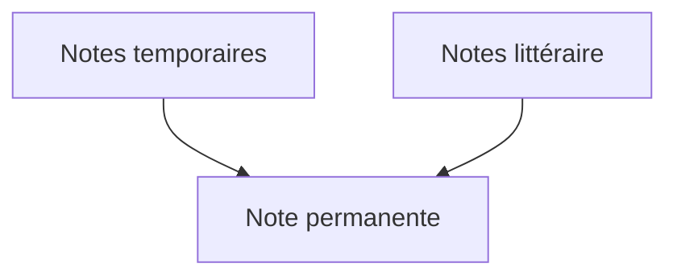

## La méthode Zettelkasten

Lorsque je prend des notes, j'utilise en partie la méthode [[Zettelkasten]].

Dès que j'ai des idées qui me viennent en tête, je prend des [[Note temporaire|notes temporaires]] dans un fichier [[Markdown]] `inbox.md` dans [[Obsidian]].

Si je lis un livre, un article, écoute un podcast ou regarde une vidéo, je rédige avec mes propres mots une [[Note littéraire|note littéraire]] de tout les **concepts** m'intéresse dans le contenu.

Une fois la [[Note littéraire|note littéraire]] terminé, sur le moment ou plus tard, je la divise en plusieurs [[Note permanente|notes permanentes]].

~~Ce sur quoi mon processus diffère de la méthode [[Zettelkasten]], c'est que je transforme directement mes notes littéraires en plusieurs notes permanentes sans garder le contenu d'origine de la note littéraire pour ne pas avoir de duplications dans [[Mon second cerveau|mon second cerveau]].~~

J'ajoute les références du contenu d'origine (URLs, page d'un livre, timecode d'une vidéo ou d'un podcast, etc...) pour avoir une trace des contenus originellement consommées.

## Les 4 règles à respecter

Voici mes **4 règles à respecter lorsque je prends des notes** :

1. Une note **ne doit pas dépasser une page**, elle doit être [[Note atomique|atomique]] (**Une note = Un concept**)
2. **Ne jamais copier-coller** un contenu.
3. **Utiliser ses propres mots** pour rédiger une note.
4. Toujours renseigner les **références** d'une note.