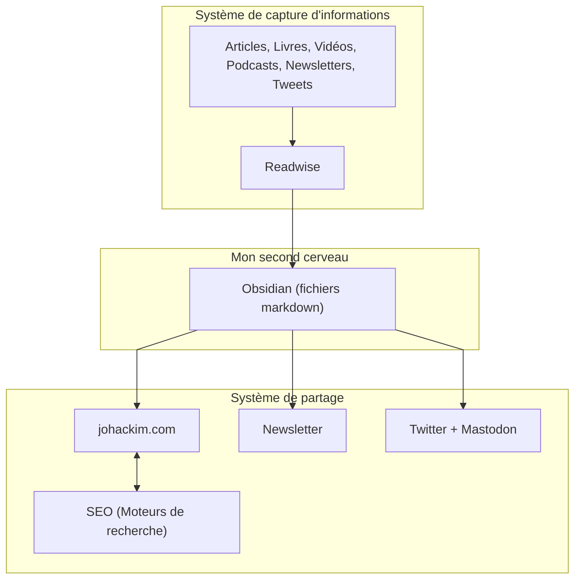

Inspiré par le concept des [[Digital Garden|digital gardens]] 🌱, [Building a Second Brain](https://buildingasecondbrain.com/) 🧠 et [Linking Your Thinking](https://linkingyourthinking.com/) 🗄️, je me suis créé un second cerveau ; un **espace d'expérimentation** où je recense et partage toutes mes **idées**, **découvertes** et **notes personnelles**.

Une sorte de **laboratoire** où j'expérimente tout un tas de sujets.

Un **second cerveau** où je stocke tous mes **modèles mentaux**.

C'est ici que je partage mes **méthodes de réflexions**.

Une sorte de **Wikipédia personnel**.

PS: Il ne s'agit pas d'un blog traditionnel où je publie de simples articles de manière chronologiques_.

## Visualisation de mon second cerveau

## Mon système de capture d'informations

C'est à cet endroit que je capture toutes les informations (RSS, Newsletters, Tweets, Vidéos YouTube, etc...).

Je ne consulte mon actualité qu'une fois par jour à l'aide de **[Readwise](https://read.readwise.io)** qui rassemble tous les blogs, les podcasts, les chaines YouTube et les newsletter que je suis.

## Mon second cerveau

C'est à cet endroit que je crée et sauvegarde toutes les informations qui me semblent pertinentes.

Il s'agit d'un ensemble de fichiers texte bruts au format **markdown** reliés entre eux par des `[[liens bidirectionnels]]`.

Ces fichiers peuvent être consultés avec n'importe quel éditeur de texte.

Personnellement, j'utilise [[Neovim]] et [[Obsidian]].

L'ensemble est versionné avec [git](https://github.com/git/git) et sauvegardé chaque jour sur un serveur externe.

## Mon système de partage

**J'automatise chaque semaine le partage de mon second cerveau.**

Toutes mes notes sont publiées sur mon blog avec [Next.js, Obsidian Publish et IPFS](https://github.com/johackim/johackim.com).

Un récapitulatif est envoyé chaque mois sur [ma newsletter](https://johackim.com/newsletter).