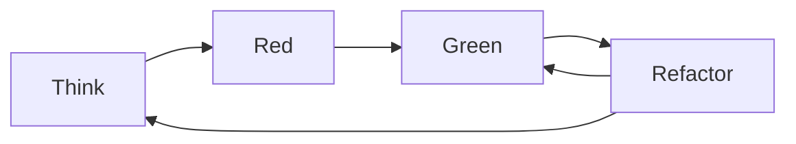

Test-Driven Development (TDD), ou Développements Pilotés par les Tests en français, est une méthode de développement de logiciel, qui consiste à concevoir un logiciel petit à petit, de façon itérative et incrémentale, en écrivant chaque test avant d'écrire le code source.

## Les 3 lois du TDD

1. Vous ne devez pas écrire un code de production tant que vous n’avez pas écrit un test unitaire d’échec.
2. Vous devez uniquement écrire le test unitaire suffisant pour échouer.
3. Vous devez uniquement écrire le code de production suffisant pour réussir le test d’échec courant.

Ces trois lois nous enferment dans un cycle qui peut durer une trentaine de secondes. Les tests et le code de production sont écrits ensemble, en commençant par les tests.

Si nous travaillons de cette manière, nous écrivons des dizaines de tests par jour, des centaines de tests par mois et des milliers de tests par an. Si nous travaillons ainsi, ces tests couvrent virtuellement tout le code de production.

## Pratiquer le TDD en 5 étapes

Le processus préconisé par TDD comporte cinq étapes :

1. Écrire un seul test qui décrit une partie du problème à résoudre
2. Vérifier que le test échoue
3. Écrire juste assez de code pour que le test réussisse
4. Vérifier que le test passe, ainsi que les autres tests existants
5. Puis refactoriser le code, c'est-à-dire l'améliorer sans en altérer le comportement

---

Références :

- https://fr.wikipedia.org/wiki/Test_driven_development
- https://amazon.fr/Test-Driven-Development-Kent-Beck/dp/0321146530/
- https://amazon.fr/Coder-proprement-Robert-C-Martin/dp/232600227X/
- https://github.com/mawrkus/js-unit-testing-guide#-whenever-possible-use-tdd