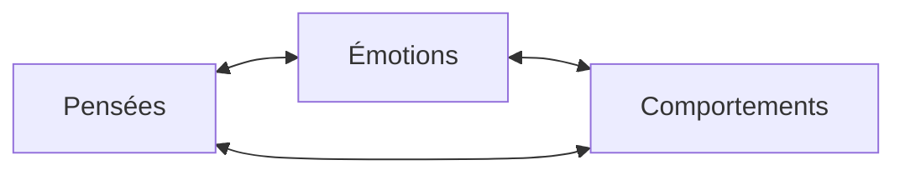

Le triangle cognitif (cognitive triangle en anglais) est un modèle utilisé en [[Thérapie cognitivo-comportementale]] qui illustre la relation entre nos pensées, nos émotions et nos comportements.

Il est basé sur l'idée que ces trois éléments sont interdépendants et s'influencent mutuellement :

- Nos pensées influencent nos émotions et nos comportements
- Nos émotions influencent nos pensées et nos comportements
- Nos comportements influencent nos pensées et nos émotions

Si l'un de ces éléments change, cela peut influencer les deux autres.

Et l'élément le plus facile à changer est la pensée.

En changeant nos pensées, nous pouvons changer les émotions et les comportements qui en découlent.

Pour cela, nous pouvons utiliser plusieurs techniques comme :

- [[Restructuration cognitive|La restructuration cognitive]]
- [[La méthode socratique]]
- [[Journal de pensées|Le journal de pensées]]

---

Références :

- https://i.imgur.com/zLgt3bF.png
- https://twitter.com/george__mack/status/1721117741057220859
- https://therapistaid.com/therapy-worksheet/cbt-triangle
- https://hudsontherapygroup.com/blog/cognitive-triangle
- [[Rewire - Nicole Vignola]]